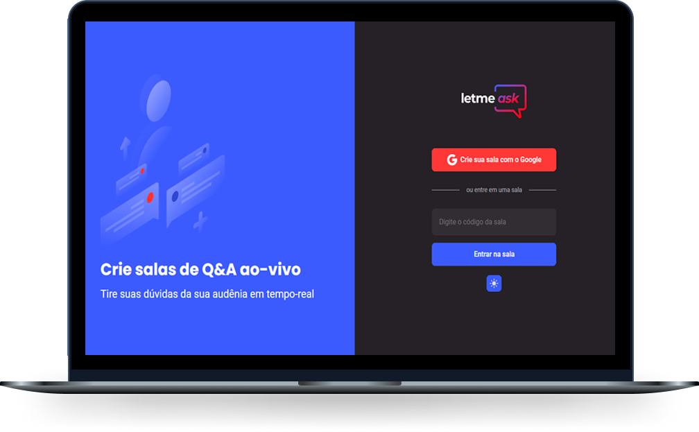

<h1 align="center">
    
</h1>

  <a href="#-tecnologias">Tecnologias</a>&nbsp;&nbsp;&nbsp;|&nbsp;&nbsp;&nbsp;
  <a href="#-projeto">Projeto</a>&nbsp;&nbsp;&nbsp;|&nbsp;&nbsp;&nbsp;
  <a href="#-layout">Layout</a>&nbsp;&nbsp;&nbsp;|&nbsp;&nbsp;&nbsp;
  <a href="#memo-licença">Licença</a>

 

  

## 🚀 Tecnologias

Esse projeto foi desenvolvido com as seguintes tecnologias:

- [React](https://reactjs.org)
- [TypeScript](https://www.typescriptlang.org/)
- [Firebase](https://firebase.google.com/)

## 💻 Projeto

O Letmeask é uma aplicação que permite a criação de salas Q&A (Questions and Answers) ou perguntas e respostas.  💜

## 🔖 Layout

Layout desenvolvido no [Figma](https://www.figma.com/) e responsivo aos dispositivos.
- [Layout](https://www.figma.com/file/py9wBu1iJwIx8Qrd48Xfrr/Letmeask)

## :memo: Licença

Esse projeto está sob a licença MIT. Veja o arquivo [LICENSE](LICENSE.md) para mais detalhes.

---

Layout e modelo da aplicação by [Rocketseat](https://github.com/rocketseat-education)